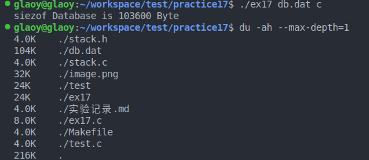

# 栈
    存储了每个函数茶ungjain的临时变量。
    函数的每个函数都会压栈，后进先出。
    使用栈的优点：当函数推出时C编译器会从栈中POP出所有变量来清理。
    如果程序中的变量不是从malloc中获取的，也不是从malloc获取的函数中获取的，那么就不在栈上。
# 堆
    是你电脑中的剩余内存，你可以通过malloc访问它来获取更多内存，OS会使用内部函数为你注册一块内存区域，并且返回指向它的指针。
    当你使用完这片区域时，你应该使用free把它交还给OS，使之能被其它程序复用。
    如果你不这样做就会导致程序“泄露”内存，但是Valgrind会帮你监测这些内存泄露。

注意：
- 如果你从malloc获取了一块内存，并且把指针放在了栈上，那么当函数退出时，指针会被弹出而丢失。
- 如果你在栈上存放了大量数据（比如大结构体和数组），那么会产生“栈溢出”并且程序会中止。这种情况下应该通过malloc放在堆上。
- 如果你获取了指向栈上变量的指针，并且将它用于传参或从函数返回，接收它的函数会产生“段错误”。因为实际的数据被弹出而消失，指针也会指向被释放的内存。
# makefile
    在包含头文件的时候必须大小写与实际头文件命名大小写统一

# 结构对齐和填充
    结构实例具有最宽标量成员的对其方式，即必须满足结果为4Byte的整数倍，不足就进行pad，且按顺序扩充，例如：
```c
struct foo1 {
char p; /* 8 bytes */
char c; /* 1 byte*/
//char pad[7]; //7 bytes //扩充的7Byte
long x; /* 8 bytes */
};
```
    本次实验中，为每个结构体添加了一个字节的char类型的test变量，不满足四个字节对齐，因此pad了三个字节，最终结构体的大小为103600Byte
```c
truct Address { //1024+8 Byte+4 Byte
    int id; // 4Byte
    int set; // 4Byte
    char name[MAX_DATA];//512Byte
    char email[MAX_DATA];//512Byte
    char test; //1Byte+[3Byte] = 4Byte
};

struct Database {
    struct Address rows[MAX_ROWS]; 
    //100*1024Byte + 100*8Byte +100*4Byte  = 103200Byte+400Byte  = 100.78KB /101.17KB
    //但是在磁盘中存储的时候根据块大小对其原理，通过du -ah --max-depth=1命令可以看到最小块大小为4K，
    //因此即使此处计算出来的大小为100.78K也会扩充到104KB进行存储
};
```

# 文件系统块对齐
    文件系统在存储数据的时候会进行块对其，例如我测试的环境块大小就为4KB
    因此会出现虽然计算的结构体占的大小为100.78KBd但是为了块对齐，文件系统存储为104KB


