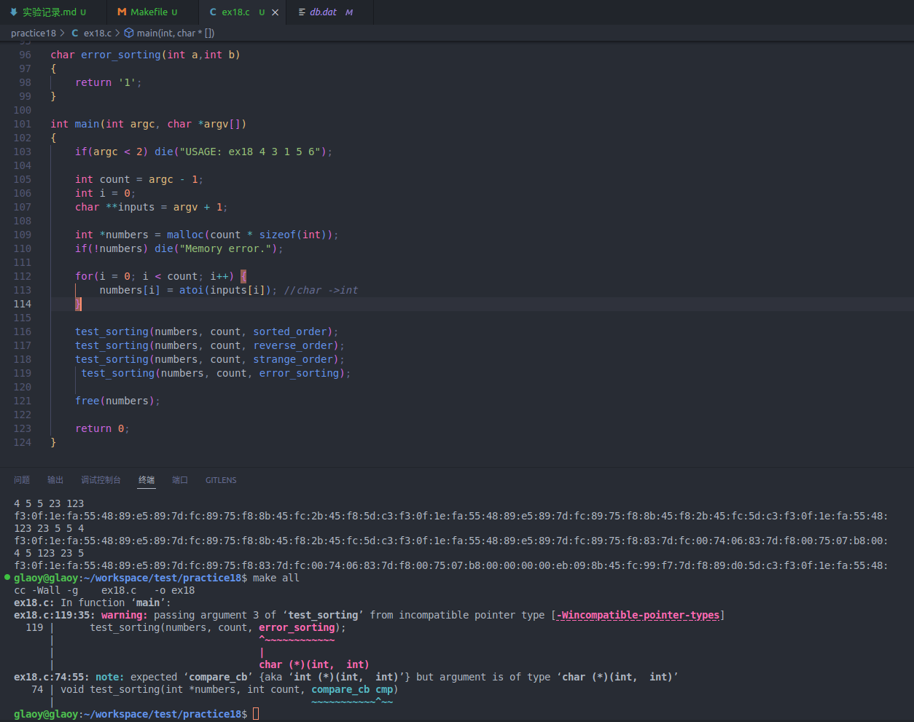

将错误的函数传递给函数指针compare_cb cmp 会报错：
```bash
ex18.c:119:35: warning: passing argument 3 of ‘test_sorting’ from incompatible pointer type [-Wincompatible-pointer-types]
  119 |      test_sorting(numbers, count, error_sorting);
      |                                   ^~~~~~~~~~~~~
      |                                   |
      |                                   char (*)(int,  int)
ex18.c:74:55: note: expected ‘compare_cb’ {aka ‘int (*)(int,  int)’} but argument is of type ‘char (*)(int,  int)’
   74 | void test_sorting(int *numbers, int count, compare_cb cmp)
      |
                                            ~~~~~~~~~~~^~~
```

将NULL参数传递给函数运行会报错:Jump to the invalid address stated on the next line
```bash
==21018== Jump to the invalid address stated on the next line
==21018==    at 0x0: ???
==21018==    by 0x10947E: test_sorting (ex18.c:77)
==21018==    by 0x10966F: main (ex18.c:119)
==21018==  Address 0x0 is not stack'd, malloc'd or (recently) free'd
==21018== 
==21018== 
==21018== Process terminating with default action of signal 11 (SIGSEGV)
==21018==  Bad permissions for mapped region at address 0x0
==21018==    at 0x0: ???
==21018==    by 0x10947E: test_sorting (ex18.c:77)
==21018==    by 0x10966F: main (ex18.c:119)
```


    int temp = 0;
    int index = 0;
    int *target = malloc(count * sizeof(int));

    if(!target) die("Memory error.");
    memcpy(target, numbers, count * sizeof(int));
    
    for(int i = 0; i < count; i++) {
        index = i;
        for(int j = i+1; j < count; j++) {
            if(cmp(target[j], temp) > 0) {
                index = j;
            }
        }
        temp = target[i];
        target[i] = target[index];
        target[index] = temp;
    }

    return target;